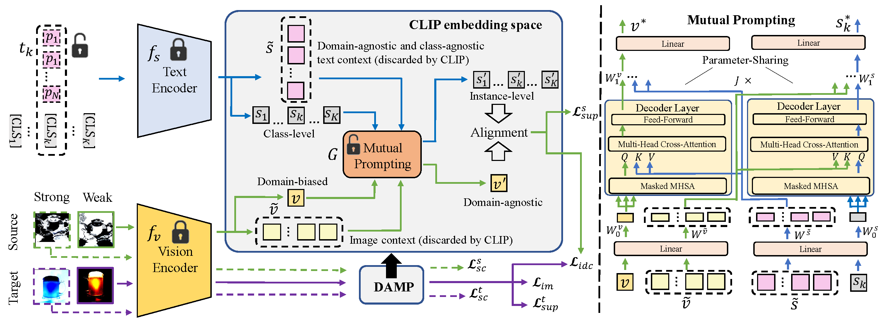

# Domain-Agnostic Mutual Prompting for Unsupervised Domain Adaptation

This repository contains the code for 'Domain-Agnostic Mutual Prompting for Unsupervised Domain Adaptation' (Accepted to CVPR 2024)

---
<div align="center">
  
</div>

---

## How to Install Dependent Environments

Our code is built based on CLIP and Dassl, which can be installed with following commands.

```bash

# install CLIP

pip install git+https://github.com/openai/CLIP.git


# install Dassl

git clone https://github.com/KaiyangZhou/Dassl.pytorch.git

cd dassl

pip install -r requirements.txt

pip install .

cd..

```

One can install other dependent tools via
```
pip install -r requirements.txt
```

## How to Download Datasets
The datasets used for UDA tasks can be downloaded via the following links.

VisDA17 (http://ai.bu.edu/visda-2017/#download)

Office-Home (https://drive.google.com/file/d/0B81rNlvomiwed0V1YUxQdC1uOTg/view?resourcekey=0-2SNWq0CDAuWOBRRBL7ZZsw)

Mini-DomainNet (http://ai.bu.edu/DomainNet/)

After downloading the datasets, please update the dataset paths in `scripts/{dataset}.sh` accordingly.

## How to Run the Code

We provide scripts for running UDA experiments on Office-Home, VisDA17, Mini-DomainNet datasets in the `scripts` folder.

For instance, to run a task on VisDA17:

```bash

cd scripts

sh VisDA17.sh

```

## Citation
If you find the code useful in your research, please consider citing:

    @InProceedings{du2024domain,
      author = {Zhekai Du, Xinyao Li, Fengling Li, Ke Lu, Lei Zhu, Jingjing Li},
      title = {Domain-Agnostic Mutual Prompting for Unsupervised Domain Adaptation},
      booktitle = {IEEE Conference on Computer Vision and Pattern Recognition},
      year = {2024}
    }


## Acknowledgments

This project builds upon the invaluable contributions of following open-source projects:

1. DAPrompt (https://github.com/LeapLabTHU/DAPrompt)
2. CoOp (https://github.com/KaiyangZhou/CoOp)

We express our sincere gratitude to the talented authors who have generously shared their source code with the public, enabling us to leverage their work in our own endeavor.
